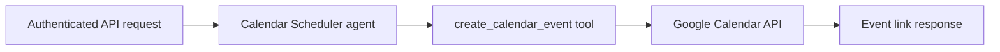

# Calendar Scheduler Agent

A FastAPI prototype that uses the OpenAI Agents SDK to translate natural-language scheduling requests into explicit Google Calendar event-creation tool calls.

## Implemented flow



The API reuses one agent instance across requests. The agent can call the typed `create_calendar_event` tool, which exchanges local Google OAuth credentials for a Calendar API client, inserts an event into the primary calendar, and returns the event's HTML link.

## API

`POST /v1/schedule` accepts a natural-language prompt and returns the agent's final reply.

```bash
curl --request POST http://localhost:8000/v1/schedule \
  --header 'Content-Type: application/json' \
  --header "X-API-KEY: ${API_TOKEN}" \
  --data '{"prompt":"Schedule a project review tomorrow from 2:00 PM to 2:30 PM."}'
```

Request body:

```json
{
  "prompt": "Schedule a project review tomorrow from 2:00 PM to 2:30 PM."
}
```

Response shape:

```json
{
  "reply": "Agent-generated response"
}
```

Requests must include the configured `API_TOKEN` in the `X-API-KEY` header. The API rejects an incorrect token, and requests fail until the source-code placeholder is replaced through configuration.

## Local setup

Python 3.11 or newer is required.

```bash
python -m venv .venv
source .venv/bin/activate
python -m pip install -e '.[dev]'
```

## Required credentials

Create a local `.env` file (ignored by Git) with:

```dotenv
OPENAI_API_KEY=your-openai-api-key
API_TOKEN=choose-a-long-random-api-token
```

- `OPENAI_API_KEY` authenticates the OpenAI Agents SDK.
- `API_TOKEN` protects the scheduling endpoint through the `X-API-KEY` header. Do not use the source-code placeholder in a deployment.
- `credentials.json` is a Google OAuth desktop-client credential file obtained from Google Cloud Console. Place it at the repository root for local use; it is ignored by Git.
- `token.json` is generated at the repository root after successful Google authorization and contains reusable user credentials. It is also ignored by Git and must be treated as a secret.

On the first tool call without a valid `token.json`, Google's installed-app OAuth flow opens an interactive local authorization page. Later calls reuse or refresh the generated token.

## Run the service

With the environment variables and Google OAuth client file configured:

```bash
uvicorn calendar_agent.api.v1:app --app-dir src --reload
```

The service is then available at `http://localhost:8000`.

## Tests

The focused tool-schema test is non-destructive and does not create a calendar event:

```bash
OPENAI_API_KEY=test-value python -m pytest -q \
  src/calendar_agent/tools/calendar_event/tests/test_calendar_event_impl.py
python -m compileall -q src
```

The integration and manual test paths may call the OpenAI or Google Calendar services and can create real calendar events. Do not run them against a personal calendar without isolated test credentials and an explicit cleanup plan.

## Docker

The repository includes a normalized `Dockerfile` for a Python 3.11 multi-stage image:

```bash
docker build -t calendar-scheduler-agent .
```

The current runtime command uses Gunicorn, but Gunicorn is not yet declared in the project's dependency files. Container startup therefore needs that packaging gap resolved before deployment.

## Repository structure

```text
src/calendar_agent/
├── agent_setup.py                         # Agent instructions and tool registration
├── api/v1.py                              # FastAPI auth, models, and POST /v1/schedule
└── tools/
    ├── availability_checker/              # Unimplemented future-tool stub
    └── calendar_event/
        ├── impl.py                         # Agents SDK function-tool wrapper
        ├── google_calendar.py              # OAuth and Calendar API event insertion
        └── tests/test_calendar_event_impl.py
tests/integration/test_schedule_api.py      # External-service integration path
Dockerfile                                 # Multi-stage container definition
```

## Current limitations

- `availability_checker` is an unimplemented stub and is not registered with the agent, so the prototype does not check for conflicts before creating an event.
- Timezone handling is inconsistent: agent instructions require `America/Los_Angeles`, while the calendar tool defaults to `America/New_York`. Callers should provide explicit ISO 8601 timestamps and timezone behavior should be unified before production use.
- Event creation targets the authenticated user's primary calendar and has no confirmation, idempotency, retry, or rollback workflow.
- Authentication uses a single shared API token rather than user-scoped identity or authorization.
- Google OAuth is interactive on first use, so deployment needs a deliberate credential-provisioning strategy.
- The container runtime dependency noted above is not yet packaged.

This repository is a prototype intended to make the agent-to-tool boundary, external credential flow, and remaining production work visible.
